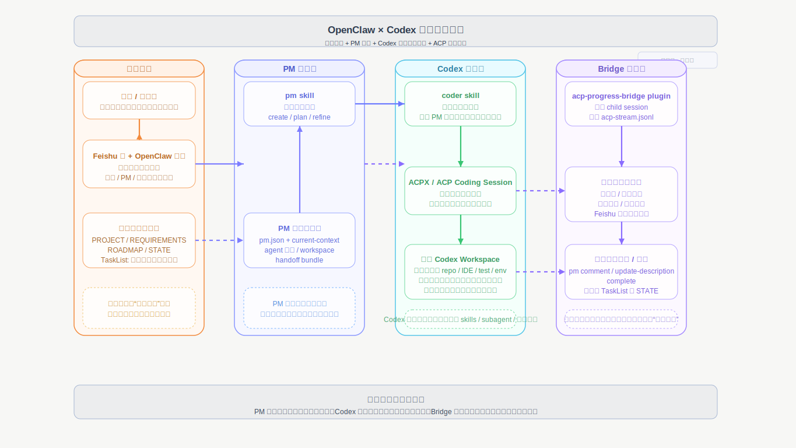
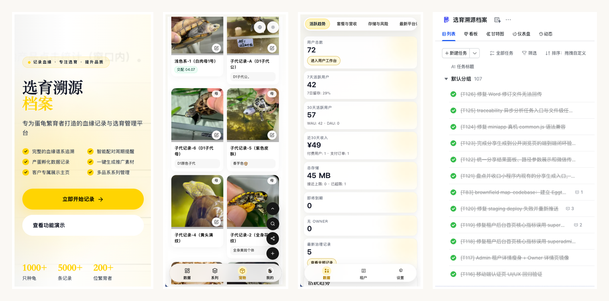
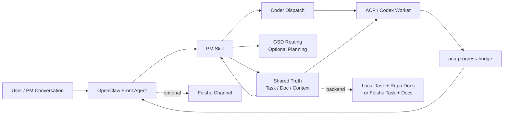

# OpenClaw Coding Kit

[English](./README.md) | [简体中文](./README.zh-CN.md)

[](https://github.com/GalaxyXieyu/openclaw-coding-kit)


> A local-first coordination kit for multi-agent coding.
> Keep task context, execution, and progress relay separate.

`OpenClaw Coding Kit` helps you stop turning one long AI coding session into a polluted mix of planning, implementation, and status tracking.

It is built for people looking for a repeatable `OpenClaw` workflow, `Codex` workflow, multi-agent coding setup, AI coding task orchestration loop, or a local-first path to Feishu-ready collaboration.

It gives you a repeatable delivery loop:

1. turn a request into tracked task context
2. hand implementation off to a dedicated coding role
3. relay child-session progress back to the parent workflow
4. start locally, then add OpenClaw and Feishu only when you need them

This repository is not trying to replace OpenClaw itself.  
It is an operator kit layered on top of OpenClaw.



## 3-Minute Quickstart

If you only want to answer one question, make it this:

> Can this repository give me a stable local loop before I touch Feishu, OAuth, or a full collaboration setup?

This repository is easiest to understand in `local-first` mode.  
Do not start with Feishu.

Run the smallest useful path first:

```bash
python3 -m py_compile skills/pm/scripts/*.py skills/coder/scripts/*.py
python3 skills/pm/scripts/pm.py init --project-name demo --task-backend local --doc-backend repo --dry-run
python3 skills/pm/scripts/pm.py context --refresh
python3 skills/pm/scripts/pm.py route-gsd --repo-root .
```

What success looks like:

- the repo scripts load cleanly
- local task/doc context can be initialized
- the repo can produce a next-step routing result
- you have a working local-first loop before any real integration

Next:

- want OpenClaw integration? Go to [`INSTALL.md`](/Volumes/DATABASE/code/learn/openclaw-pm-coder-kit/INSTALL.md)
- want Feishu integration? Skip the README path and follow the integrated install track
- want the internal role model? Continue reading below

## Why This Exists

Most AI coding setups break down for the same reasons:

- business discussion and implementation details collapse into one polluted session
- PM-side context and coder-side execution do not share the same truth
- progress from sub-sessions is hard to route back into the parent workflow
- installation instructions, runtime config, and actual operator flow drift apart over time

This repository addresses that by making the execution path explicit instead of implicit:

- `PM` owns task intake, context refresh, document sync, and routing
- `coder` owns implementation and validation inside ACP sessions
- `acp-progress-bridge` owns progress/completion relay only
- `Feishu task/doc` is optional collaboration truth in integrated mode
- `local task + repo docs` provides the lowest-friction starting point

## Before / After

| Without this kit | With this kit |
|---|---|
| one long mixed session | explicit PM -> coder -> relay loop |
| task truth lives in chat memory | task/doc/context state is externalized |
| progress from sub-sessions gets lost | parent session receives structured progress |
| setup failures blur together | local-first smoke path isolates failure layers |
| Feishu becomes a prerequisite too early | Feishu stays optional until later |

## Who This Is For

This repository is a good fit if you are one of these:

- an individual operator who wants a cleaner local-first AI coding loop before touching collaboration tooling
- a builder who keeps losing task context across planning and implementation sessions
- a team experimenting with OpenClaw + Codex, but not ready to make Feishu a hard prerequisite
- an engineer who wants a repeatable operator path instead of an improvised long-running chat workflow

## What You Will See After Running It

After the quickstart, you should expect to see:

- repo-local PM context files under `.pm/`
- a working local task/doc mode instead of missing-backend errors
- a next-step routing result from `route-gsd`
- a clearer sense of where planning, coding, and progress relay are separated

## Visual Walkthrough

These screenshots show the kind of operator flow this repository is trying to support.

<table>
  <tr>
    <td width="50%">
      
      <p><strong>Structured initialization</strong><br/>Start from workspace, task context, and execution order, not a giant coding session.</p>
    </td>
    <td width="50%">
      
      <p><strong>Tracked iteration</strong><br/>Let evolving requirements live in task updates, files, and validation notes instead of chat memory.</p>
    </td>
  </tr>
  <tr>
    <td width="50%">
      
      <p><strong>Visible progress</strong><br/>Bring coding-session progress back to the collaboration surface with evidence and status.</p>
    </td>
    <td width="50%">
      
      <p><strong>Real delivery</strong><br/>The goal is a maintainable project with multiple surfaces, not a one-off generated page.</p>
    </td>
  </tr>
</table>

## Common Use Cases

Teams and individual operators usually land here when they want one of these:

- a local-first AI coding workflow before turning on Feishu or OAuth
- a multi-agent coding setup with clearer task routing between PM and coder roles
- an OpenClaw + Codex delivery loop that is more structured than one long chat session
- a way to keep task context, execution, and progress relay separate across sessions
- a Feishu-ready coordination layer that can still be validated without Feishu first

## When To Use This

Use this repository when you want:

- a local-first validation path before touching real collaboration systems
- a clearer boundary between PM reasoning and coder execution
- a repeatable OpenClaw + Codex + ACP workflow instead of one long improvised session
- optional Feishu integration without making Feishu a hard prerequisite for smoke checks

Skip this repository if you only need:

- a single-agent one-off coding session
- no task tracking or write-back at all
- no need to preserve context across planning and execution roles

## What You Get

| Area | Included | Purpose |
|---|---|---|
| Task orchestration | `skills/pm` | task intake, context refresh, doc sync, GSD routing |
| Execution worker | `skills/coder` | canonical ACP coding worker |
| Product canvas | `skills/product-canvas` | unified product flow board, scenario assets, miniapp/web UI review entrypoint |
| Board truth layer | `skills/interaction-board` | page inventory, draw.io board, HTML board, screenshot-ready manifest |
| Feishu bridge reuse | `skills/openclaw-lark-bridge` | calls Feishu tools from a running OpenClaw gateway |
| Progress relay | `plugins/acp-progress-bridge` | sends child-session progress and completion back to the parent |
| Config references | `examples/*` | minimal and extended config snippets |
| Verification | `tests/*` | repo-local validation baseline |

## Operating Modes

Start with the smallest mode that proves value:

### Local-First

Use this when your goal is to verify the repo, not the whole collaboration stack.

Recommended config:

```json
{
  "task": { "backend": "local" },
  "doc": { "backend": "repo" }
}
```

Good for:

- smoke checks
- PM/coder/GSD routing validation
- bootstrap verification
- installation debugging without Feishu

### Integrated

Use this only after the local-first path is stable:

- Codex + OpenClaw runtime
- agent binding and ACP execution
- Feishu bot / group / task / doc integration
- progress bridge and authorization flows

## FAQ

**Do I need Feishu to try this repository?**

No. The recommended first run is local-first and does not require Feishu.

**Do I need a full OpenClaw runtime before the quickstart?**

No. The quickstart is designed to verify the repo-local loop first.

**Is this only for teams?**

No. The first value is often for a single operator who wants cleaner separation between task context and coding execution.

**Is this replacing OpenClaw?**

No. This repository is a coordination layer on top of OpenClaw, not a replacement for it.

**What kind of workflow is this repository trying to improve?**

It is aimed at OpenClaw and Codex users who want a more repeatable AI coding workflow, especially when work spans planning, execution, and progress relay across multiple sessions.

## Architecture At A Glance



Editable diagram sources:

- [`diagrams/openclaw-coding-kit-architecture.svg`](/Volumes/DATABASE/code/learn/openclaw-pm-coder-kit/diagrams/openclaw-coding-kit-architecture.svg)
- [`diagrams/openclaw-coding-kit-architecture.drawio`](/Volumes/DATABASE/code/learn/openclaw-pm-coder-kit/diagrams/openclaw-coding-kit-architecture.drawio)

## Installation Strategy

Recommended order:

1. install runtime prerequisites first
2. verify repo-local smoke path
3. deploy `pm`, `coder`, `openclaw-lark-bridge`, and `acp-progress-bridge`
   preferred entrypoint: `python3 scripts/sync_local_skills.py --target both`
4. wire `openclaw.json` and `pm.json`
5. only then add Feishu bot, group, permissions, and OAuth when required
6. finish with real backend initialization and E2E verification

That order is intentional.  
It keeps runtime problems, config problems, and collaboration-system problems from collapsing into one debugging session.

## Repository Layout

```text
openclaw-coding-kit/
  README.md
  README.zh-CN.md
  INSTALL.md
  examples/
    openclaw.json5.snippets.md
    pm.json.example
  plugins/
    acp-progress-bridge/
  skills/
    coder/
    openclaw-lark-bridge/
    pm/
  tests/
  diagrams/
    openclaw-coding-kit-architecture.drawio
    openclaw-coding-kit-architecture.svg
```

## Design Principles

- `PM` is the tracked-work front door
- `coder` executes; it does not own task/doc truth
- `GSD` owns roadmap/phase planning, not task/doc truth
- `bridge` is a relay, not a source of truth
- default to `local/repo` first, real Feishu second
- keep the OpenClaw baseline on `2026.3.22`, not `2026.4.5+`

## Feishu Integration Notes

If you enable `@larksuite/openclaw-lark`:

- bot creation, sensitive permission approval, version publishing, and `/auth` / `/feishu auth` still include manual user steps
- PM now supports common `env` / `file` / `exec` SecretRef resolution for `appSecret`
- do not keep both built-in `plugins.entries.feishu` and `openclaw-lark` enabled at the same time

That last point matters. Duplicate Feishu tool registration can cause tool conflicts and, in heavier environments, even destabilize CLI introspection.

Detailed install and permission guidance:

- [`INSTALL.md`](/Volumes/DATABASE/code/learn/openclaw-pm-coder-kit/INSTALL.md)

## Compatibility

| Item | Baseline |
|---|---|
| Python | `>= 3.9` |
| Node.js | `>= 22` |
| OpenClaw | `2026.3.22` |
| PM state dir | prefers `openclaw-coding-kit`, still falls back to legacy `openclaw-pm-coder-kit` |

## Included References

- [`INSTALL.md`](/Volumes/DATABASE/code/learn/openclaw-pm-coder-kit/INSTALL.md)
- [`examples/pm.json.example`](/Volumes/DATABASE/code/learn/openclaw-pm-coder-kit/examples/pm.json.example)
- [`examples/openclaw.json5.snippets.md`](/Volumes/DATABASE/code/learn/openclaw-pm-coder-kit/examples/openclaw.json5.snippets.md)

## Security

Do not commit:

- real `appId` / `appSecret`
- OAuth token or device auth state
- real group IDs, allowlists, user identifiers
- real tasklist GUIDs or document tokens
- local session stores or runtime caches
