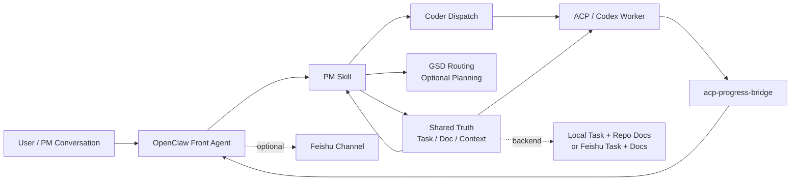

# OpenClaw Coding Kit

[English](./README.md) | [简体中文](./README.zh-CN.md)

[](https://github.com/GalaxyXieyu/openclaw-coding-kit)


> 一个面向多智能体编程的本地优先协同套件。
> 把任务上下文、代码执行和进度回传分开管理。

`OpenClaw Coding Kit` 要解决的问题很直接：不要再把一次长 AI 编程会话做成“规划、实现、同步、汇报”全混在一起的上下文污染现场。

它面向的是这样一类需求：想找一套可重复的 `OpenClaw` 工作流、`Codex` 工作流、多智能体 coding 协作方式、AI coding 任务编排闭环，或者想先本地验证、再逐步接到 Feishu 协同环境里。

它提供的是一个可重复的交付闭环：

1. 先把用户请求整理成可追踪的任务上下文
2. 再把实现工作交给专门的 coding 角色
3. 把子会话进度回传给父流程
4. 默认先本地验证，确实需要时再接 OpenClaw 和 Feishu

这个仓库不是要替代 OpenClaw。  
它是叠加在 OpenClaw 之上的一层协同操作套件。


## 3 分钟快速验证

如果你只想先回答一个问题，就看这个：

> 在不接 Feishu、不折腾 OAuth、也不做完整集成的前提下，这个仓库能不能先给我一个稳定的本地闭环？

理解这个仓库的最佳入口是 `local-first`。  
不要一开始就接 Feishu。

先跑最小可验证路径：

```bash
python3 -m py_compile skills/pm/scripts/*.py skills/coder/scripts/*.py
python3 skills/pm/scripts/pm.py init --project-name demo --task-backend local --doc-backend repo --dry-run
python3 skills/pm/scripts/pm.py context --refresh
python3 skills/pm/scripts/pm.py route-gsd --repo-root .
```

看到下面这些结果，就说明第一步已经通了：

- 仓库脚本能正常加载
- 本地 task/doc 上下文可以初始化
- 仓库可以给出下一步路由结果
- 你已经拿到一个不依赖真实集成的 local-first 闭环

下一步：

- 想接 OpenClaw 集成，去看 [`INSTALL.md`](./INSTALL.md)
- 想接 Feishu，直接按完整集成安装路径走
- 想理解内部角色分工，继续往下看

## 这个项目为什么存在

大多数 AI coding 工作流会在几个地方失控：

- 业务讨论和实现细节混在一个会话里，越来越脏
- 任务上下文和真正执行逐渐漂移，不再共享同一个事实
- 子会话做了很多事，但父会话拿不到结构化进度
- 安装说明、运行时配置和实际操作路径慢慢脱节

这个仓库的处理方式不是“再加一个大而全框架”，而是把执行路径显式化：

- `PM` 负责任务接入、上下文刷新、文档同步和路由
- `coder` 负责 ACP 会话里的实现与验证
- `acp-progress-bridge` 只负责进度和完成态回传
- `Feishu task/doc` 在集成模式下是可选协同后端
- `local task + repo docs` 是默认的最低摩擦起点

## 改造前 / 改造后

| 没有这套工具时 | 使用这套工具后 |
|---|---|
| 一次长会话里什么都做 | 明确拆成 PM -> coder -> relay |
| 任务真相只存在聊天上下文里 | task/doc/context 被外部化 |
| 子会话做完了但进度回不来 | 父会话能收到结构化进度 |
| 安装失败、配置失败、协同失败混在一起 | local-first 验证先隔离失败层级 |
| Feishu 很早就变成前置依赖 | Feishu 可以后置成可选集成 |

## 这套东西适合谁

如果你属于下面这些人，这个仓库通常会更有价值：

- 想先把本地 AI coding 闭环跑顺，再决定要不要接协同系统的个人使用者
- 经常在规划会话和实现会话之间丢任务上下文的开发者
- 正在尝试 OpenClaw + Codex，但又不想一开始就把 Feishu 变成硬前置的团队
- 不想继续靠“一条很长的聊天记录”支撑交付，而想要更稳定操作路径的工程师

## 跑完之后你会看到什么

完成 quickstart 后，正常应该看到：

- `.pm/` 下生成 repo-local PM 上下文文件
- local task/doc 模式正常工作，而不是一上来就缺 backend
- `route-gsd` 能给出下一步路由结果
- 你能直观看到规划、编码和进度回传已经被拆开

## 可视化示例

下面这组截图，更接近这套仓库想支持的真实操作路径。

<table>
  <tr>
    <td width="50%">
      
      <p><strong>结构化初始化</strong><br/>先把 workspace、任务上下文和执行顺序立起来，而不是直接开一条很长的 coding 会话。</p>
    </td>
    <td width="50%">
      
      <p><strong>可追踪迭代</strong><br/>需求变化应落在任务、附件和验证说明里，而不是继续散在聊天记录里。</p>
    </td>
  </tr>
  <tr>
    <td width="50%">
      
      <p><strong>协作面可见进度</strong><br/>把 coding 子会话里的阶段状态和结果回带到协作面，而不是留在黑盒里。</p>
    </td>
    <td width="50%">
      
      <p><strong>真实交付结果</strong><br/>最终目标是一个可持续迭代、可持续维护的项目，而不是一次性 demo。</p>
    </td>
  </tr>
</table>

## 典型使用场景

个人用户和小团队通常会因为下面这些需求找到这个仓库：

- 想先做 local-first 的 AI coding 工作流验证，再决定要不要接 Feishu 或 OAuth
- 想做一套更清晰的多智能体 coding 协作，把 PM 和 coder 的职责拆开
- 想把 OpenClaw + Codex 用成一条可重复交付链路，而不是一条很长的聊天记录
- 想把任务上下文、代码执行和进度回传分开，减少跨会话漂移
- 想要 Feishu-ready 的协同层，但第一次验证时又不想被 Feishu 卡住

## 适合什么场景

如果你希望：

- 先在本地把流程跑通，再去碰真实协同系统
- 把 PM 推理和 coder 执行明确分开
- 用可重复的 OpenClaw + Codex + ACP 工作流代替一条即兴长会话
- 把 Feishu 作为可选集成，而不是 smoke check 的硬前置

那么这个仓库适合你。

如果你只需要：

- 单 agent 的一次性编码会话
- 完全不需要任务追踪和写回
- 不在意规划和执行之间的上下文隔离

那这套仓库可能对你来说偏重。

## 仓库里有什么

| 区域 | 内容 | 作用 |
|---|---|---|
| 任务编排 | `skills/pm` | 任务接入、上下文刷新、文档同步、GSD 路由 |
| 执行角色 | `skills/coder` | 标准 ACP coding worker |
| 产品画布 | `skills/product-canvas` | 统一的产品流转画布、scenario 资产、Web/miniapp UI review 入口 |
| Board 真值层 | `skills/interaction-board` | 页面矩阵、draw.io 草图、HTML 画布、截图位 manifest |
| Feishu 桥接复用 | `skills/openclaw-lark-bridge` | 复用运行中 OpenClaw gateway 的 Feishu 工具 |
| 进度回传 | `plugins/acp-progress-bridge` | 把子会话进度和完成态发回父流程 |
| 配置参考 | `examples/*` | 最小与扩展示例配置 |
| 验证基线 | `tests/*` | 仓库本地验证基础 |

## 运行模式

先从最小、最能证明价值的模式开始：

### Local-First

如果你的目标是先验证仓库，而不是直接把整套协同系统装起来，就先用这个模式。

推荐配置：

```json
{
  "task": { "backend": "local" },
  "doc": { "backend": "repo" }
}
```

适合：

- smoke check
- PM/coder/GSD 路由验证
- bootstrap 验证
- 不接 Feishu 的安装排障

### Integrated

只有在 local-first 已经稳定后，再切到这个模式：

- Codex + OpenClaw runtime
- agent binding 和 ACP 执行
- Feishu bot / 群 / task / doc 集成
- progress bridge 与授权链路

## FAQ

**试这个仓库一定要先接 Feishu 吗？**

不用。推荐的第一次验证路径就是 local-first，不需要 Feishu。

**做 quickstart 之前一定要先把完整 OpenClaw runtime 装好吗？**

不用。quickstart 的目的就是先验证 repo-local 闭环。

**这套东西是不是更偏团队，不适合个人？**

不是。它的第一层价值往往就是给单个 operator 用来拆开任务上下文和代码执行。

**这个仓库是在替代 OpenClaw 吗？**

不是。它是叠加在 OpenClaw 之上的协同层，不是替代品。

**它主要想解决哪类 AI coding 工作流问题？**

它主要面向 OpenClaw 和 Codex 用户，解决的是规划、执行、进度回传跨多个会话时容易混乱、漂移、难追踪的问题。

## 架构一览



可编辑图源：

- [`diagrams/openclaw-coding-kit-architecture.svg`](./diagrams/openclaw-coding-kit-architecture.svg)
- [`diagrams/openclaw-coding-kit-architecture.drawio`](./diagrams/openclaw-coding-kit-architecture.drawio)

## 安装策略

推荐顺序：

1. 先装运行时依赖
2. 先验证 repo-local smoke path
3. 再部署 `pm`、`coder`、`openclaw-lark-bridge` 和 `acp-progress-bridge`
   推荐入口：`python3 scripts/sync_local_skills.py --target both`
4. 再写 `openclaw.json` 和 `pm.json`
5. 只有需要时再接 Feishu bot、群、权限和 OAuth
6. 最后再做真实 backend 初始化和 E2E 验证

这个顺序是故意这样设计的。  
它的目的就是避免把运行时问题、配置问题和协同系统问题混在同一次排障里。

## 仓库结构

```text
openclaw-coding-kit/
  README.md
  README.zh-CN.md
  INSTALL.md
  examples/
    openclaw.json5.snippets.md
    pm.json.example
  plugins/
    acp-progress-bridge/
  skills/
    coder/
    openclaw-lark-bridge/
    pm/
  tests/
  diagrams/
    openclaw-coding-kit-architecture.drawio
    openclaw-coding-kit-architecture.svg
```

## 设计原则

- `PM` 是 tracked work 的前门
- `coder` 负责执行，不拥有 task/doc 真相
- `GSD` 负责 roadmap/phase 规划，不拥有 task/doc 真相
- `bridge` 只是 relay，不是 source of truth
- 默认先走 `local/repo`，真实 Feishu 后接
- OpenClaw 基线固定在 `2026.3.22`，不默认追新到 `2026.4.5+`

## Feishu 集成说明

如果你启用了 `@larksuite/openclaw-lark`：

- bot 创建、敏感权限审批、版本发布以及 `/auth` / `/feishu auth` 仍然包含用户手动步骤
- PM 已支持常见 `env` / `file` / `exec` SecretRef 方式解析 `appSecret`
- 不要同时启用内置 `plugins.entries.feishu` 和 `openclaw-lark`

最后这点很重要。两套 Feishu 工具同时注册时，可能出现工具名冲突；在更重的环境里，甚至会拖垮 CLI introspection 稳定性。

更完整的安装和权限说明：

- [`INSTALL.md`](./INSTALL.md)

## 兼容性

| 项目 | 基线 |
|---|---|
| Python | `>= 3.9` |
| Node.js | `>= 22` |
| OpenClaw | `2026.3.22` |
| PM state dir | 优先 `openclaw-coding-kit`，仍兼容旧名 `openclaw-pm-coder-kit` |

## 相关参考

- [`INSTALL.md`](./INSTALL.md)
- [`examples/pm.json.example`](./examples/pm.json.example)
- [`examples/openclaw.json5.snippets.md`](./examples/openclaw.json5.snippets.md)

## 安全提示

不要提交以下内容：

- 真实 `appId` / `appSecret`
- OAuth token 或设备授权状态
- 真实群 ID、allowlist、用户标识
- 真实 tasklist GUID 或 doc token
- 本地 session store 或运行时缓存
