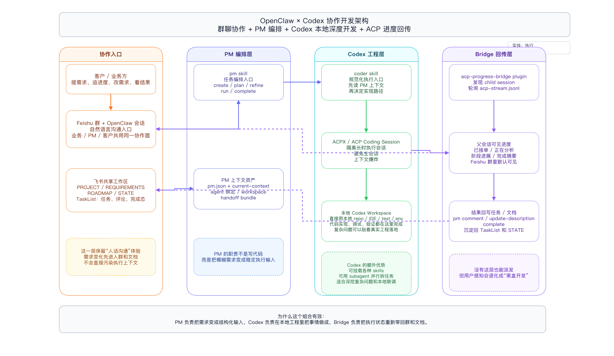
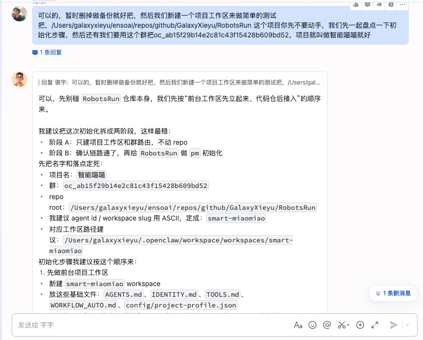
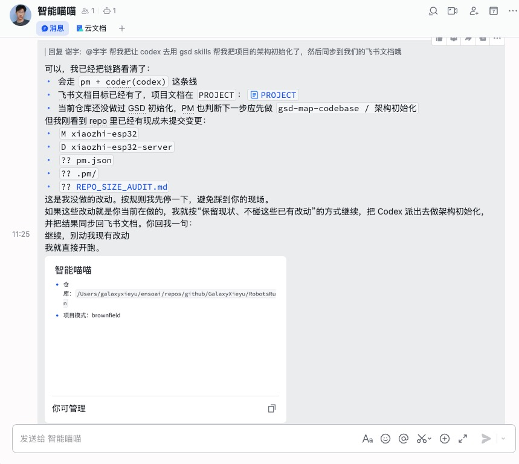
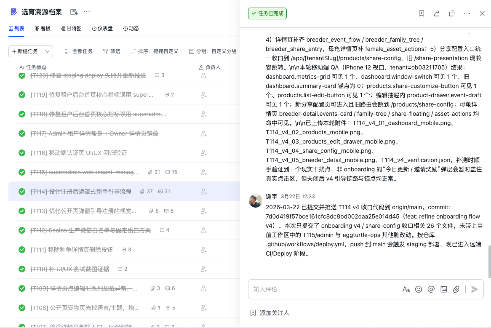
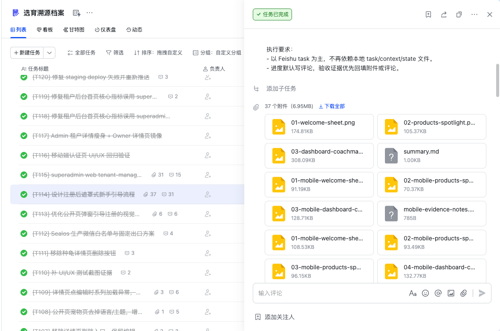

# 把 OpenClaw 当主持人，把 Feishu 当平台，把 Codex 放回本地工程

龙虾拿来聊需求、推进项目，体验确实顺。问题是，只要需求稍微复杂一点，这种顺很快就会变味：会话越滚越长，上下文越来越乱，前面说过的话后面还得再翻一遍。改了几轮需求之后，聊天记录里什么都有，真正对开发有用的信息反而最难找。  

如果这时候你还想把 Codex、Claude Code 这类本地 coding agent 接进来，问题会更明显。一边是龙虾，适合沟通、协作、和客户来回对齐；另一边是本地工程环境，更适合贴着真实 repo 写代码、跑测试、排查麻烦的问题。两边都好用，但如果没有一套清楚的协作方式，最后很容易变成来回转述，信息断层，进度也没人看得见。

我现在比较稳定的一套做法，不是把所有能力都塞进一个 agent，而是老老实实分层。

更准确地说，我想做的不是把所有能力都塞进 OpenClaw 里，而是反过来分工：

- `Codex`、`Claude Code` 这类本地 coding agent，负责真正的多智能体执行
- `OpenClaw` 负责当主持人，接任务、分角色、串流程
- `Feishu` 负责当平台，承接群沟通、文档、任务、评论、附件这些协作资产

这样做的好处很直接。多智能体开发还是放在我们更熟悉、也更容易落地的本地工程环境里做；OpenClaw 不需要自己变成一个什么都包的“超级开发框架”，把主持、路由和衔接做好就够了；飞书则把协作这件事稳稳接住。

换句话说，我要的不是“一个更大的 agent”，而是一套更顺手的协作结构。

在这个分工下面，我当前主要用的是三层能力：

- `PM`：负责在龙虾 / 飞书这一层和人沟通，把模糊需求整理成结构化任务和项目上下文
- `Codex`：负责在本地工程环境里真正把事情做成，直接用 repo、IDE、测试环境和各种 skills
- `ACP Progress Bridge`：负责把子会话里的进度和完成结果重新回传到父会话，让群里的人随时能看到状态

这套东西不是为了演示好看，我自己已经拿它跑过相对复杂的真实项目。下面这些截图就是我之前一个宠物项目里的实际产出，前台、后台、任务协作、需求迭代、进度回传都有。

## 先看结果：一个真实项目能做到什么程度

如果你更关心这套东西到底有没有生产力，那最直接的方式不是先看架构图，而是先看结果。

下面这张图，来自我之前做过的一个真实宠物项目，不是贪吃蛇，也不是 todolist。这个项目里有宠物展示、后台管理、支付、引导链路、部署和持续迭代，已经不是“随便生成几个页面”那种量级了。

从左到右分别是：

- 首页落地页
- 宠物展示页
- 后台数据页
- 任务协作页

我更在意的一点是，这不是一次性的生成结果，而是能持续迭代、持续交付、后面还能继续维护的项目。

## 这套架构里，每个角色到底负责什么

如果硬要压成一句话，这套方式就是把复杂项目拆成 4 层，各管各的，但又能接起来：

- 协作入口层：负责承接客户、业务、PM 的日常沟通
- PM 编排层：负责把模糊需求变成结构化任务、文档和执行上下文
- Codex 工程层：负责在本地真实工程环境里把事情做成
- Bridge 回传层：负责把子会话进度和完成结果带回父会话

如果换成“具体是谁在干什么”来看，可以再压成下面这张边界表：

| 角色 | 主要负责什么 | 不负责什么 |
| --- | --- | --- |
| `PM` | 接需求、梳理任务、维护项目文档、生成 coder handoff、把阶段结果写回任务与文档 | 不直接承担深度编码、复杂调试、长链路联调 |
| `GSD` | 在复杂项目里维护 roadmap、phase、plan，把大任务拆成可推进的阶段和执行顺序 | 不直接当对外协作入口，也不取代 PM 去接需求和维护项目真相 |
| `Codex` | 在本地真实工程里开发、调试、测试、验证，必要时用 subagent 和 skills 并行推进 | 不负责长期对外沟通，也不负责做项目层面的任务编排 |
| `OpenClaw` | 做主持、路由、技能挂载、会话衔接，让 PM 和 coding agent 能接起来 | 不应该变成承载全部开发工作的超级框架 |
| `Feishu` | 承接群沟通、文档、任务、评论、附件这些共享协作资产，提供所有人都能持续插话的协作面 | 不负责本地代码执行，也不替代工程环境和 CLI 工作流 |

你也可以把它理解成一句更直接的话：`PM` 负责把事情接住，`GSD` 负责把复杂项目拆开，`Codex` 负责把事情做成，`OpenClaw` 负责把这些角色串起来，`Feishu` 负责把协作资产留住。

下面这张图，就是我现在这套协作方式的分工图：

从左往右看，基本就是一条很直接的链路：

### 1. 协作入口层

这一层主要就是龙虾 / 飞书群这种“说人话”的地方。

它不负责深度开发，主要负责几件事：

- 接住客户和业务方的需求
- 承接追进度、改需求、补充背景这些高频动作
- 把讨论留在一个所有人都能看到的协作面里

这一层最重要的价值，就是把沟通这件事留在一个大家都舒服的界面里。  
客户不需要理解 repo、分支、CLI，也不需要知道你本地怎么跑，只需要在群里说清楚想法、追进度、补需求。

### 2. PM 编排层

这一层更像整个系统的项目调度中心。

PM 不负责把代码怼完，它更重要的事是：

- 初始化项目上下文
- 维护任务清单和项目文档
- 把模糊需求整理成 task、plan、refine、coder-context
- 决定当前应该做什么、下一步该派发给谁

它跟飞书的关系也不是“发条消息”那么浅，而是真的会去用飞书里的项目资产：

- 飞书文档：维护 `PROJECT / REQUIREMENTS / ROADMAP / STATE`
- 飞书任务：创建、搜索、更新、完成任务
- 飞书评论：沉淀阶段进展和完成摘要
- 飞书附件：挂验证材料、截图、交付产物

所以我一直把 PM 理解成项目编排层，不是聊天机器人。

### 3. Codex 工程层

这一层才是真正把复杂开发工作落到地上的地方。

它的优势也不只是“能接任务”，而是它工作在本地真实工程环境里：

- 直接使用本地 repo、IDE、测试环境、日志和依赖
- 能贴着真实代码做调试、联调、验证
- 可以挂很多 skills，扩展自己的工作能力
- 可以用 subagent 并行拆任务，处理复杂问题

所以这层不是把聊天记录复制给另一个模型那么简单，而是把任务送进一个更适合做工程执行的环境。

### 4. Bridge 回传层

如果没有这一层，前面 3 层也能跑，但体验会一下子掉回黑盒开发。

Bridge 的职责是：

- 观察 Codex 子会话进度
- 把阶段状态同步回父会话
- 把完成结果重新带回群和任务系统

这样业务方和 PM 在群里就能直接看到：

- 任务是否已经开工
- 现在是在分析、实现还是验证
- 阶段性结果是什么
- 最终完成了什么

这一步很关键。没有它，执行和协作是断开的；有了它，深度执行和外部可见性才算重新接上。

## 这套方式到底解决了什么问题

传统流程里，业务方先跟项目经理聊，项目经理再转给开发，开发做到一半发现实现有问题，又要折返回来确认。中间最烦的损耗基本就 3 个：

1. 需求在“人话 -> 技术语言 -> 代码实现”之间来回转换，信息容易丢
2. 开发和业务不在同一个上下文里，进度不可见，甲方只会觉得你在黑盒里干活
3. 一旦需求多轮迭代，聊天上下文会越来越混乱，越到后面越难维护

我现在这套方式，核心思路其实很朴素：把“沟通”和“深度开发”拆开，但别让它们彼此失联。

- 在龙虾 / 飞书里保留顺畅的人话沟通体验
- 在飞书文档和 TaskList 里维护共享上下文真相
- 在本地用 Codex 贴着真实工程开发、调试、测试
- 用 ACPX 把 PM 和 Codex 串起来
- 用 progress bridge 把子会话进度重新同步回群里

这样一来，业务、PM、开发虽然分工不同，但围绕的还是同一套任务和文档真相。需求变化能直接沉淀到文档和任务里，开发也能在本地保持比较干净的执行环境，不需要把所有复杂推理都硬塞回聊天窗口。

## 为什么我会设计成 PM + Codex 这两个角色

我现在越来越不相信“一个万能 agent 包打天下”这件事了。真到复杂项目里，还是角色边界清楚更重要。

`PM` 的价值不在于写代码，而在于：

- 跟客户、业务、项目协作方说人话
- 把需求整理成任务、文档、阶段目标、验收口径
- 维护共享上下文，让后续执行有稳定输入

`Codex` 的价值也不只是“会写代码”，而是它在本地工程环境里有很强的执行深度：

- 直接读写本地 repo
- 可以跑测试、看日志、调环境、联调真实依赖
- 可以装很多 skills，扩展自己的工作能力
- 可以用 subagent 并行处理复杂任务
- 对长上下文 coding 和实际工程问题的处理更稳

所以这不是传统意义上“一个 PM + 一个 developer”的翻版，更像是把 AI 的长处重新排了一下位置：

- 一个角色专注沟通、编排、文档化
- 一个角色专注本地开发、调试、验证、交付

这对一人公司、小团队、外包型交付，或者需求老在变的项目尤其有用。因为你终于不用在一个会话里同时扮演“客户接口人”和“深度开发者”了。

## PM 里其实还预设了一层 GSD 能力

前面一直在讲 `PM + Codex`，但这套 PM 里其实还预留了一层 `GSD` 能力，只是它不是站在最前台的角色。

我对它的定位很明确：

- `PM` 是入口，负责接需求、建任务、整理上下文、写回任务和文档
- `GSD` 是后端，负责 roadmap、phase、plan 这一层的规划和执行编排

换句话说，`PM` 负责把事情接住，`GSD` 负责把复杂项目拆成能推进的阶段和计划。  
我不希望用户一上来就直接面对一堆 GSD 命令，所以这些能力被包在 PM 后面，而不是单独当成另一套前台工作流。

PM 现在已经预设了几类 GSD 能力：

- `pm route-gsd`：判断当前 phase 下一步该做什么
- `pm plan-phase`：产出或刷新某个 phase 的计划
- `pm sync-gsd-docs`：把 `.planning/*` 里的内容同步回项目文档
- `pm sync-gsd-progress`：把阶段进展同步回 PM / 文档状态
- `pm materialize-gsd-tasks`：把 phase plan 映射成 tracked tasks

它不是只有命令入口这么简单。  
现在 PM 还会把 GSD phase 的上下文、计划路径、required reads 这些信息挂到任务和 coder handoff 上，后面 `Codex` 真正开始做事的时候，拿到的就不只是“做这个任务”，而是“这个任务在整个 phase 里属于哪一段、先读哪些文件、按什么计划推进”。

## 为什么这里还要用 GSD

不是每个项目都需要 GSD。  
如果只是小任务、小页面、一次性改动，直接 `PM -> Codex` 就够了，没必要把事情再搞复杂。

但项目一旦开始变大，GSD 的价值就出来了。

我用它主要是为了 3 件事：

### 1. 让复杂项目按 phase 推进，而不是靠人脑硬记

项目一复杂，需求不会只是一条条平铺的 todo。  
它会有阶段、有依赖、有先后顺序，还会有“这件事做之前得先把哪件事弄明白”的问题。

GSD 的作用，就是把这些东西落到 roadmap、phase、plan 这几个层面上。  
这样后面推进的时候，不用每次都重新从聊天记录里判断“下一步到底该干嘛”。

### 2. 让规划和执行分层，不要全塞给当前会话

很多 AI 协作最后会失控，一个很大的原因就是：规划和执行全塞在同一个上下文里。

GSD 在这里的意义，是把复杂规划这件事放到更稳定的规划层里。  
执行的时候，PM 和 Codex 只消费已经收敛出来的 phase plan 和上下文，而不是每次都在主会话里重新推一遍。

### 3. 让任务不是孤立的，而是挂在项目推进链路上

单个任务如果脱离 roadmap 和 phase，很容易变成做一条忘一条。  
今天看起来完成了，过几天回头看，不知道它为什么做、和哪个阶段有关、后面还连着什么。

GSD 把任务放回整个项目推进链路里。  
这样无论是 PM 在看，还是 Codex 在做，拿到的都不是孤立的一个点，而是整个项目里的一段。

所以你可以把 GSD 理解成这套架构里的“项目推进后端”。  
它不是前台入口，不直接替代 PM，也不是 source of truth owner。它更像是 PM 背后那套专门处理 roadmap、phase、plan 的发动机。

## 为什么不是直接用 OpenClaw 的 subagent

先说结论：`subagent` 当然可以用，而且在很多场景下是有价值的。

如果只是做简单的任务拆分、并行处理，或者让多个 agent 在 OpenClaw 体系里协作，它完全够用。我现在这套方式没有直接押在 `subagent` 上，不是因为它不能用，而是因为它没有覆盖我最在意的那部分工作流。

### 1. 它能解决派活，但没有解决“随时提问”

复杂项目不是把任务派出去一次就结束了。  
客户会随时插话，业务会临时补需求，项目经理会一直追进度。真正麻烦的不是“怎么把任务丢出去”，而是任务丢出去之后，外面的人还能不能继续插入、继续追问、继续看见过程。

如果主执行层直接压在 `subagent` 上，这一层的协作体验并不会自动变好。  
你还是需要一个所有人都能随时提问、补充信息、追状态的协作面。对我来说，这个协作面更适合放在飞书群里，而不是只停留在 agent 内部委派链上。

### 2. 它没有解决本地环境和权限问题

我本地已经有现成的 repo、IDE、测试环境、脚本、依赖，还有自己长期积累的 skills 和工作流。  
这些东西一旦真的拿来做复杂项目，会非常实际：路径、权限、依赖、调试方式、脚本入口、测试命令，都会影响效率。

如果把主执行层放到 OpenClaw 里的 `subagent` 上，很多东西等于要重新初始化一套。  
环境要重新处理，权限要重新配置，工具可用性要重新确认，最后往往不是能力不够，而是整条开发手感被拆断了。

### 3. 它会把我原本顺手的工作流拆开

我平时就是在本地工程里开发、调试、验证。  
`Codex`、`Claude Code` 这类本地 agent，本来就天然贴着这套工作流工作。

如果把主要执行切到 OpenClaw 的 `subagent`，那就变成另一套运行方式。  
很多时候问题不在于“能不能做”，而在于“做起来是不是顺”。对复杂项目来说，顺不顺差别很大。

### 4. 它也没有真正解决上下文问题

`subagent` 可以分任务，但上下文管理不会因为“多开几个 agent”就自动变好。

项目一复杂，需求、文档、任务、评论、阶段结果还是需要一个稳定的外部真相来承接。  
如果没有这个层，最后还是会回到聊天记录越来越长、上下文越来越乱、要不断翻前文的老问题。

所以我最后的选择不是“全都放进 OpenClaw 里做”，而是分层：

- 本地的 `Codex` / `Claude Code` 负责真正的多智能体开发和工程执行
- `OpenClaw` 负责主持、路由和衔接
- `Feishu` 负责承接群沟通、文档、任务、评论和附件

换句话说，`subagent` 能解决“派活”，但解决不了复杂项目里那些更麻烦的问题：随时提问、持续追问、本地环境复用、权限控制、上下文沉淀。  
我不是不用它，而是它覆盖不到我最在意的那部分工作流。

## 共享工作区是这套模式的核心

这套方式能稳定跑起来，不是因为多了几个 agent，而是因为背后有一个共享云端工作区。

我现在通常用的是飞书工作区，把它当成项目的“外部记忆”：

- 文档：`PROJECT` / `REQUIREMENTS` / `ROADMAP` / `STATE`
- TaskList：任务、评论、责任人、附件、完成状态
- 群会话：日常沟通、需求补充、阶段追踪、结果同步

所以在我眼里，飞书不只是一个消息通知工具，更像整套协作系统的“平台层”。  
这样无论是 PM 在龙虾里说话，还是 Codex / Claude Code 在本地执行，都不是各干各的，而是围着同一套项目真相在做事。

## 实际上是怎么开始跑起来的

真要开始用，其实步骤不复杂，大致就是下面几步。

### 1. 新建飞书群，作为项目会话入口

先建一个独立的项目群，把客户、PM 和机器人放到同一个协作面里。后续所有需求、补充说明、进度追踪，都尽量留在这个群里。

### 2. 初始化项目工作区和仓库绑定

这一步的目标不是马上开写，而是先把项目名、群、repo、workspace、agent 路由这些基础信息打通。  
我一般会把初始化拆成两段：先把项目工作区和路由建立起来，再做 PM / Codex 的完整初始化。

**项目初始化示例**

初始化完成之后，PM 至少知道这是哪个项目、对应哪个群、挂哪个 repo，后面应该把任务派给谁。

### 3. 把需求沉淀到共享文档和任务里

不是所有东西都应该继续堆在聊天记录里。  
需求讨论到一定程度后，就应该沉淀到项目文档和任务系统中，让它变成后续执行的正式输入。

项目一复杂，真正稳定的上下文就不可能靠翻聊天记录获得了，只能靠结构化的任务和文档。

### 4. PM 派发，Codex 在本地工程里执行

当任务整理清楚之后，PM 会通过 ACPX 把任务派到 Codex 那一层。  
到了这一步，Codex 的优势才真正开始显出来：

- 它在本地工程里工作，不是漂浮在纯聊天上下文里
- 它能直接看 repo、跑测试、调试、改代码
- 它可以装各种 skills，补充自己的能力边界
- 对于复杂问题，它还可以开 subagent 并行拆任务

所以这层不是“把聊天转给另一个模型”就结束了，而是真的把任务送进一个适合做深度工程执行的地方。

## 为什么这套模式不会变成黑盒开发

很多人真正担心的，其实不是“能不能派发”，而是“派发出去以后，我还能不能看见过程”。

如果只有 PM 和 Codex，没有进度回传层，体验其实还是差。因为从群里看，你只是把任务丢进了一个黑盒，外面看不到它在干嘛，也不知道卡在哪。

所以 `acp-progress-bridge` 这一层非常重要。它会把子会话里的阶段进展、完成摘要等信息重新回推到父会话里。

**进度回传示例**

这意味着在飞书群里，业务方和 PM 可以直接看到：

- 已经开始处理了没有
- 现在在分析、开发还是验证
- 有没有阶段性结论
- 最终完成了什么

这一点能明显减少“开发是不是在黑盒里闷头干活”的不确定感。

## 需求变更和验收也可以在同一套体系里完成

复杂项目不可能一次说清楚。真正重要的是，需求变了之后，有没有一个稳定的地方把这些变化接住。

我比较满意的一点是，这套模式里，需求变化、任务附件、评论、验证结果都能回到同一个 TaskList 和文档体系里，而不是散在几个不同的会话里。

**需求迭代与验收示例**

这样做的好处是：

- 需求变更有记录
- 附件和验证材料能挂在任务上
- 评论区能沉淀阶段结论
- 完成态不是一句“做完了”，而是可以追溯的

## 这套方式适合什么人

我觉得它尤其适合下面几种场景：

- 一人公司或小团队，需要同时兼顾客户沟通和研发交付
- 复杂项目，需求会持续变化，不适合靠单轮 prompt 硬顶
- 想保留龙虾 / 飞书这种顺滑协作体验，但又想把真正的工程执行放到本地完成
- 需要经常看进度、追状态、补需求，而不是把开发当黑盒

## 最后总结

如果只看表面，这套模式像是多装了几个 skill，多接了一层 ACP。  
但我自己越用越觉得，它真正解决的，是“多智能体开发到底应该放在哪一层”这个问题：

怎么让“会说人话的项目协作”和“贴着真实工程的深度开发”同时成立，而且别互相打架。

我现在的答案很简单：

- 用 `Codex`、`Claude Code` 这类本地 agent 去做真正的多智能体执行
- 用 `OpenClaw` 去做主持、分发、路由和衔接
- 用 `Feishu` 去做协作平台，承接群沟通、文档、任务和附件
- 用 `PM` 和 `progress bridge` 把上下文编排与进度回传补齐

这样做的结果是，你既不会失去龙虾这一层顺手的协作体验，也不会牺牲本地 coding 的深度和质量。  
更重要的是，OpenClaw 不需要自己什么都做，飞书也不只是聊天入口，本地 agent 也不需要脱离真实工程环境。每一层都做自己最擅长的事，整套协作才会顺。对复杂项目来说，这比把所有事情都塞进一个会话里，稳得多。
